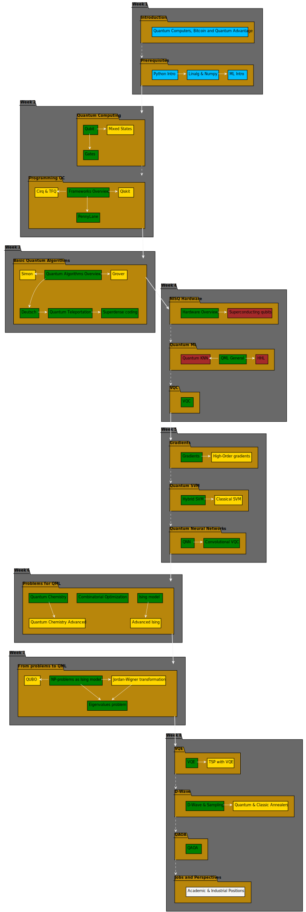

</img>

# `QMLCourse` (категорически русская версия)

<!-- <a href="https://github.com/quantum-ods/qmlcourse/raw/web-page-prod/latex/qmlcourse.pdf">
     -->
</a>

  
  
  
  <!--    -->

 

## Помощь в развитии

В файле [CONTRIBUTING.md](./CONTRIBUTING.md) все детали и правила.

### Обсуждения и вопросы

Идеи, предложения, замечания и т.п. можно указать во вкладке [discussions](https://github.com/quantum-ods/qmlcourse/discussions). Также можете воспользоваться вкладкой [issues](https://github.com/quantum-ods/qmlcourse/issues).

## Программа

### Как читать схему?

- **ГОЛУБОЙ** -- вводные лекции;
- **ЗЕЛЕНЫЙ** -- лекции "основного" блока курса;
- **ЖЕЛТЫЙ** -- лекции, глубже раскрывающие темы блоков;
- **КРАСНЫЙ** -- лекции про физику и математику, которая стоит за всем этим;
- **БЕЛЫЙ** -- факультативные лекции.

## Команда

Основные авторы, рецензенты, редакторы, тех часть можете найти [здесь](https://quantum-ods.github.io/qmlcourse/book/authors.html).

## ODS

Чтобы присоединиться ознакомтесь со <https://ods.ai/tracks/mattermost>.

## Похожие проекты

- [Телеквант](https://telequant.ru/)

    Платформа для обучения квантовому программированию, где учащиеся могут отработать навыки квантового программирования на эмуляторе 30-кубитного квантового компьютера, размещенного в облаке VK Cloud. Интерфейс работы с эмулятором квантового компьютера реализован в виде простого диалога в чат-ботах Telegram или ВКонтакте. Бот принимает на вход программный код на языке квантового программирования OpenQASM 2.0, проводит вычисления и возвращает пользователю ответ.

- [Квантовые технологии](https://openedu.ru/course/msu/QUANTUMTECH/)

    Курс лекций посвящен рассмотрению современного уровня развития важной отрасли - квантовых технологий, а также ее ближайших и долгосрочных перспектив. Еженедельные занятия содержат тематические видеолекции и тестовые задания с автоматизированной проверкой результатов. Также предусматривается написание реферата-рассуждения по заданным темам, которое должно содержать полные развёрнутые ответы, подкреплённые примерами из лекций и-или научной литературы.

- [Введение в квантовые вычисления](https://distant.msu.ru/mod/page/view.php?id=45122)

     Ознакомление со бурно развивающейся областью науки и технологии на стыке физики и компьютерных наук – квантовыми вычислениями. Занятия включают видео-лекции и выполнение тестовых заданий с автоматизированной проверкой результатов. Также составляющей курса является самостоятельное решение предложенных задач.

- [Основы квантовых вычислений CERN](https://russol.info/quantum)

    Подходит для начинающих. Лекции разбиты на короткие части, конспекты прокомментированы и проиллюстрированы. Базируется на открытом курсе CERN introductory lectures on quantum computing

----

[Написать письмо](mailto:qmlcourse.ods@gmail.com)
